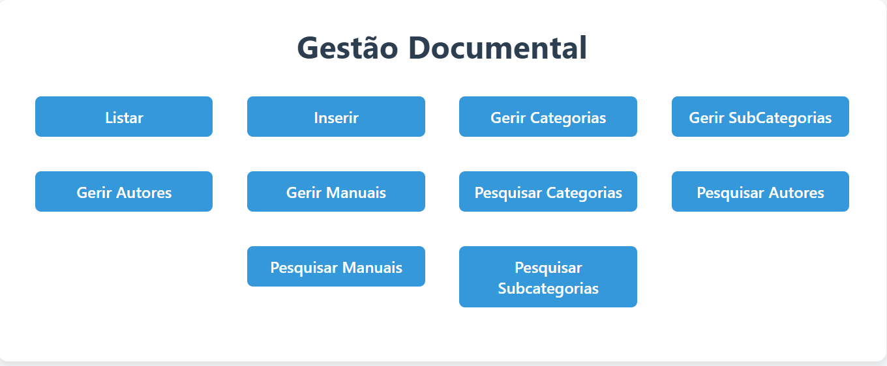
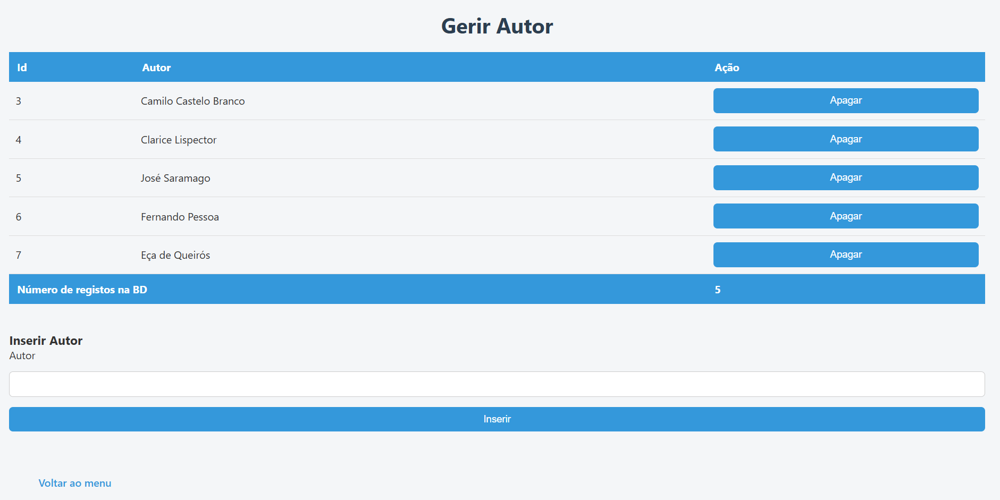
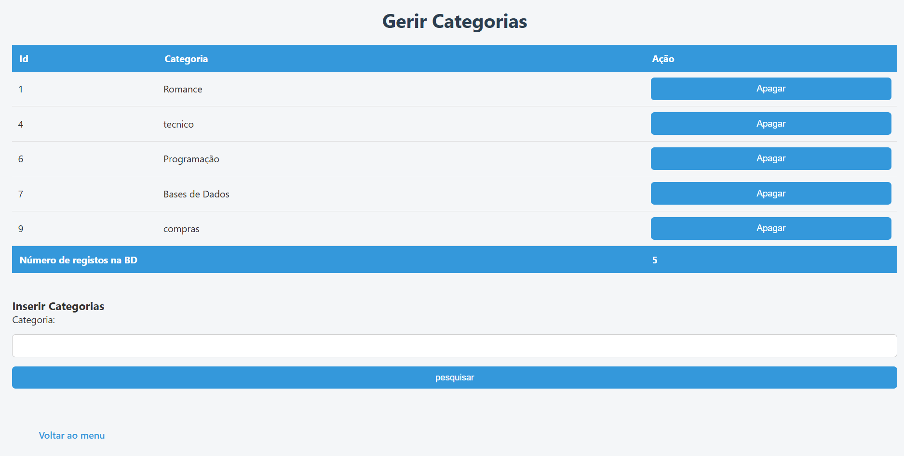
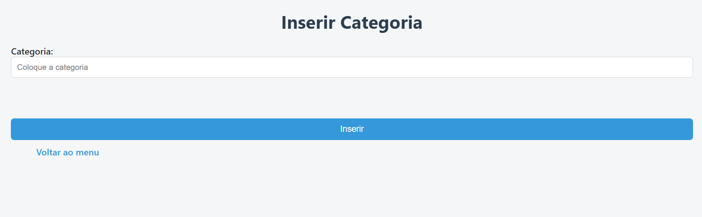
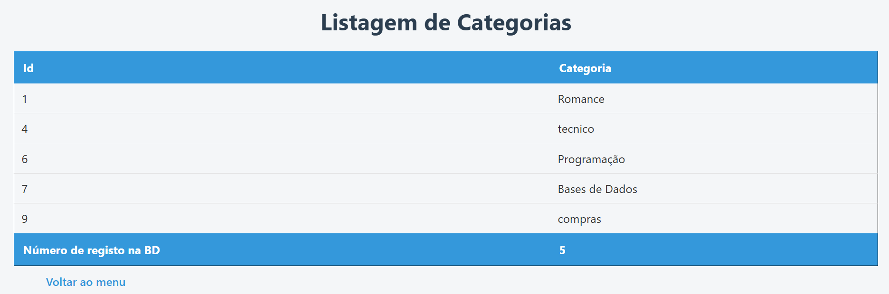
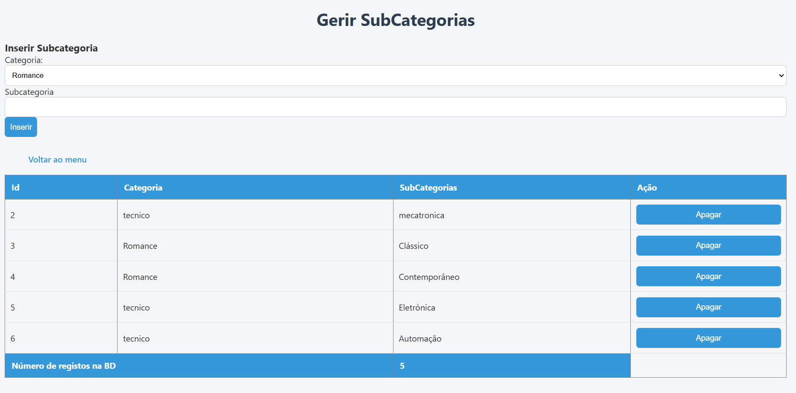
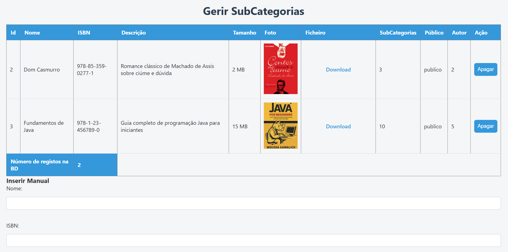
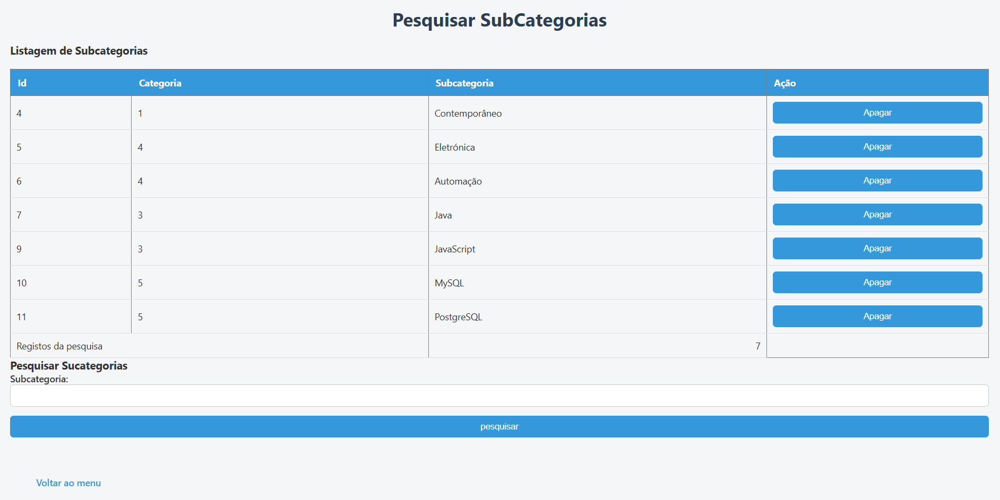
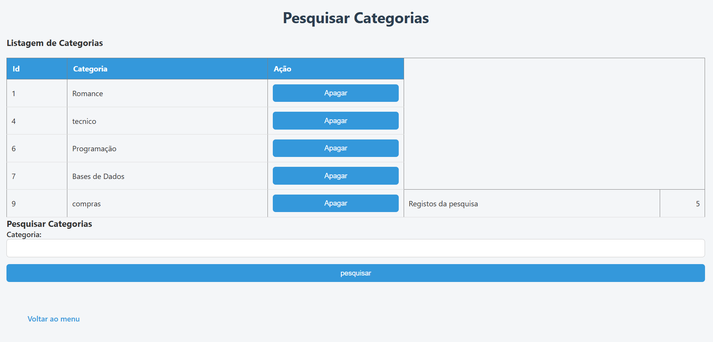

# Sistema de Gestão Documental

Sistema Web desenvolvido em Java utilizando JSP para gestão de documentos, categorias, subcategorias, autores e manuais.

## Funcionalidades
- Cadastro de categorias e subcategorias
- Cadastro de autores
- Cadastro de manuais
- Pesquisa de registros
- Interface Web com JSP

## Tecnologias utilizadas
- Java
- JSP
- HTML
- CSS
- Apache Tomcat

## Como executar
1. Importar o projeto no Eclipse ou NetBeans
2. Configurar servidor Apache Tomcat
3. Executar o projeto
4. Acessar pelo navegador

## Objetivo
Projeto desenvolvido para fins acadêmicos e portfólio.

## Telas do Sistema

### Tela Inicial

### Gerir Autores

### Gerir Categorias

### Inserir Categorias

### Listagem de Categorias

### Gerir Subcategorias

### Gerir Subcategorias (2)

### Pesquisar Subcategoria

### Pesquisar Autor

### Pesquisar Categoria

